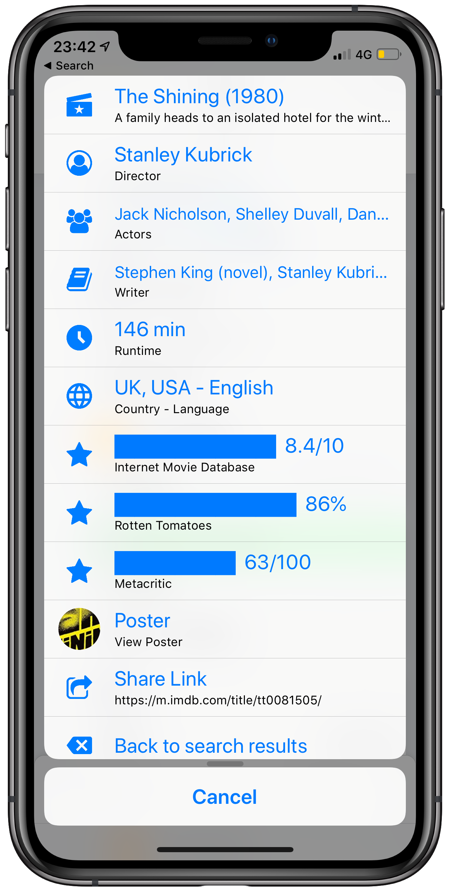

# IMDB
#### IMDB Lookup

IMDB Lookup Share Sheet, selecting any of the details like director, actor, ratings will take you to the imdb page. Started from an unknown source IMDB shortcut, but highly modified.

## OMDB API Key
You will need an API Key from OMDB in order to use the Shortcut. When first running the Shortcut you will be asked for this. You can get a key before running by going to the [OMDB site](http://www.omdbapi.com/apikey.aspx)

## Looking up a film
Highlight the name of a film and Share to the Shortcut, or run the Shortcut and enter the title of a film.

## Viewing Film Details
If you select any of the film details like title, director, the Shortcut will show you the IMDB page for the film.

Selecting Poster will view the poster full screen.

#### Other Shortcuts by me
Other Shortcuts by me can be found on [RoutineHub](https://routinehub.co/user/entee)
