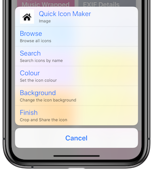
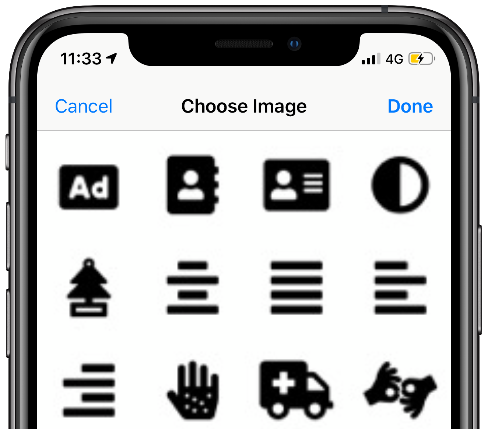
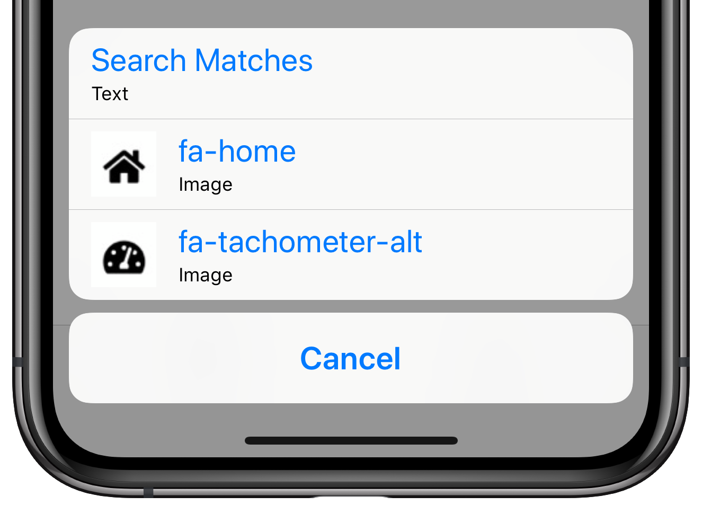
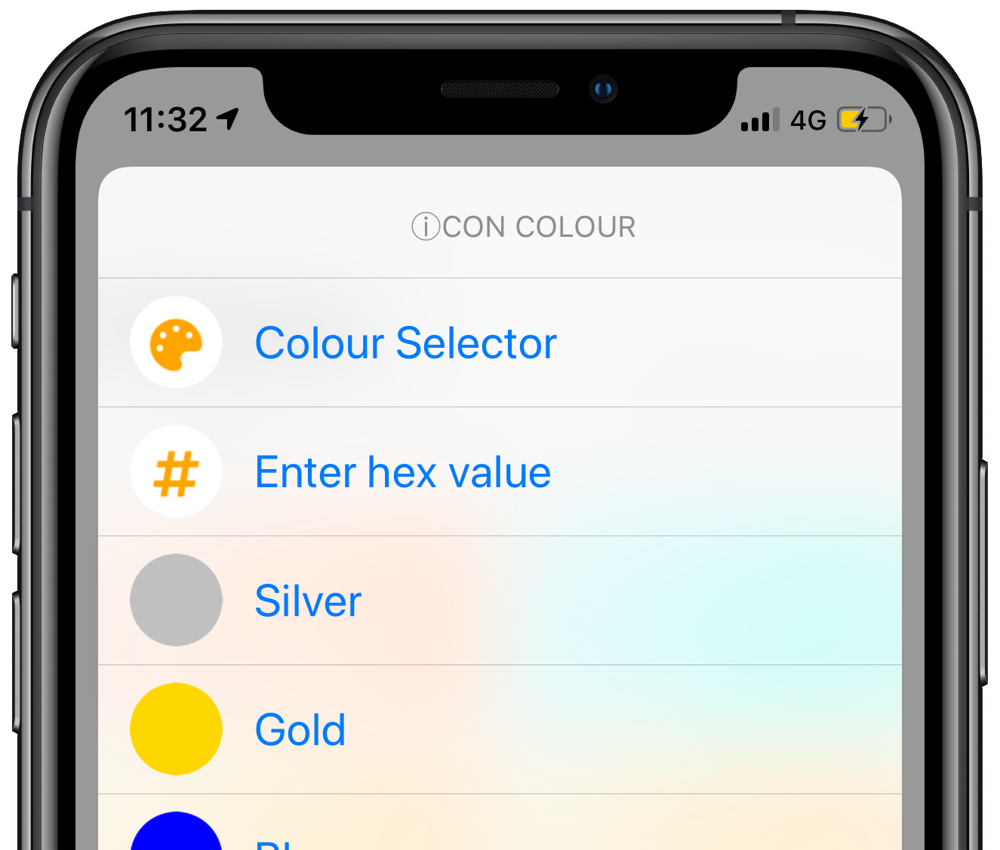
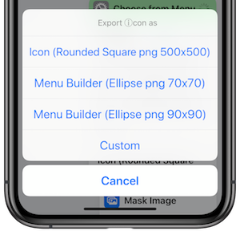

# Quick Icon Maker
#### Makes an icon with font awesome.

Easily create icons by Searching by name, or choose from an image.

- Quick export options and 
- Select Icon by typing the name, searching and or choosing from icons.
- Easy to search on names like archive, address card, bookmark, database, bed, bicycle.
- Can be called from other Shortcuts.

## Making an icon

### Menu

At the top of the menu there is a preview of the current settings for the icon. When first launched it shows the default home icon. Select the preview at any time to see a large view of the icon.

#### Browse
Quick preview of available icons. 

#### Search
Search for icons by name.

#### Colour and Background
Quick list of simple colours, choose from lots of colour shades, or enter a hex value for colour.

#### Finish
Will first present you with a series of quick options, or you can select custom for your own settings.

## Running from another Shortcut
You can run this from another Shortcut, just pass the name of the Shortcut running it, and it will use the name in the menus, and return the selected icon to the Shortcut calling it rather than showing the file/photos/Base64 option.

Eg Is used in Home Launcher which puts contact/shortcut/links in one Home Screen Launcher. https://routinehub.co/shortcut/1030

#### Thanks
Color Selector by HeyItzSpencer https://routinehub.co/shortcut/828

#### Other Shortcuts by me
Other Shortcuts by me can be found on [RoutineHub](https://routinehub.co/user/entee)