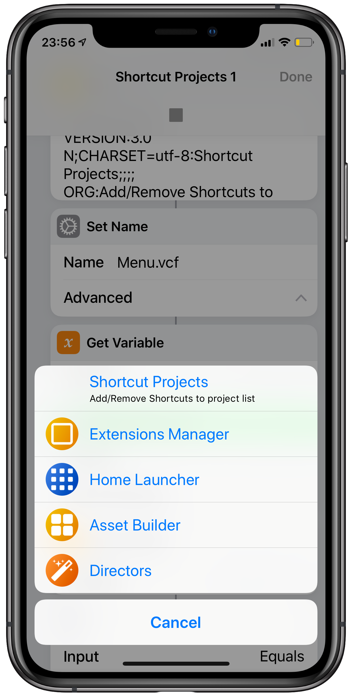

# Shortcut Projects

#### A quick launcher and backup for Shortcuts you're currently working on.

A shortcut to keep at the top of your Shortcuts, you add or remove which Shortcuts you're developing currently, when you select a Shortcut it takes a quick backup, and goes to the edit screen for the Shortcut.

You can skip to editing your project quickly
Backups each time before it opens Shortcut for editing. So you can skip back to an earlier version anytime.

#### Other Shortcuts by me
Other Shortcuts by me can be found on [RoutineHub](https://routinehub.co/user/entee)